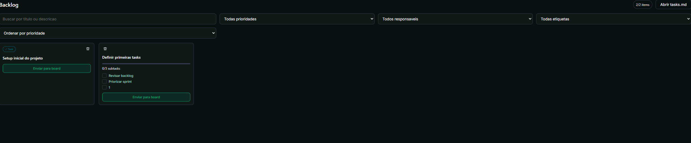
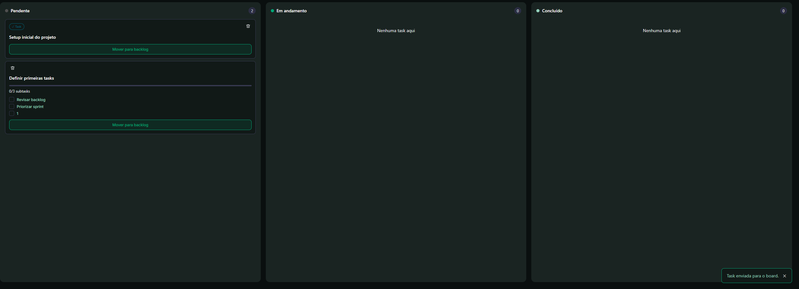

# CodeSprint

CodeSprint e uma plataforma desktop criada para tornar o planejamento de software mais visivel, colaborativo e conectado ao fluxo real de desenvolvimento.

Ao combinar board visual, area de backlog, integracao com GitHub e uma fonte de verdade baseada em markdown, o CodeSprint ajuda equipes a sairem de um planejamento espalhado para uma execucao mais clara, organizada e eficiente.

## Visao Geral do Projeto

Equipes de software costumam dividir o planejamento entre varios lugares desconectados: issues no GitHub, anotacoes pessoais, chats, boards estaticos e arquivos locais do projeto. Essa fragmentacao gera perda de contexto, esforco duplicado e pouca visibilidade sobre o que realmente precisa ser feito.

O CodeSprint foi criado para centralizar esse processo em uma experiencia pratica, visual e proxima do ambiente real de desenvolvimento.

Com o CodeSprint, as equipes podem:

- conectar uma conta do GitHub
- selecionar um repositorio
- vincular o clone local real no computador
- gerenciar tarefas em visualizacoes de backlog e board
- editar o mesmo arquivo `tasks.md` pelo app ou pelo VS Code
- sincronizar alteracoes com o GitHub quando necessario

## Funcionalidades Principais

- autenticacao com GitHub
- selecao de repositorio e vinculacao com pasta local
- gestao de tarefas em fluxo local-first
- atualizacao em tempo real quando o `tasks.md` e alterado fora do app
- visualizacao em board estilo Kanban
- visualizacao em backlog
- suporte a metadados de tarefa, como responsavel, prioridade, etiquetas, descricao e subtarefas
- atribuicao de responsaveis com base nos colaboradores do GitHub
- sincronizacao manual entre trabalho local e repositorio remoto

## O Problema

Ferramentas de planejamento geralmente ficam distantes do codigo que deveriam apoiar.

Isso gera problemas frequentes:

- o planejamento fica desconectado da execucao
- as equipes perdem visibilidade entre backlog e trabalho em andamento
- atualizacoes dependem de repeticao manual entre ferramentas
- os desenvolvedores trabalham no repositorio, mas o planejamento vive em outro lugar

O CodeSprint resolve isso ao transformar o proprio repositorio em parte do fluxo de planejamento.

## A Solucao

No centro da plataforma existe uma ideia simples: o backlog do projeto nao deve ficar isolado do proprio projeto.

O CodeSprint transforma o `tasks.md` em uma camada colaborativa de planejamento conectada tanto a interface quanto ao repositorio. O resultado e um fluxo em que as tarefas podem ser criadas, revisadas, atribuidas, reorganizadas e sincronizadas sem perder portabilidade nem controle.

## Como Funciona

1. O usuario conecta uma conta do GitHub e seleciona um repositorio.
2. A plataforma vincula esse repositorio ao seu clone local real.
3. O CodeSprint le e escreve tarefas por meio de um arquivo compartilhado `tasks.md`.
4. As tarefas podem ser gerenciadas visualmente em visualizacoes de backlog e board.
5. O mesmo arquivo tambem pode ser editado diretamente no ambiente de desenvolvimento.
6. A sincronizacao com o GitHub acontece quando o usuario decide, preservando um fluxo local-first.

Essa abordagem mantem o projeto transparente, portavel e facil de integrar ao fluxo de trabalho real de desenvolvimento.

## Screenshots

### Tela de Login

 

### Selecao de Repositorio

 

### Visualizacao de Backlog

 

### Visualizacao de Board
 

### Detalhes da Tarefa / Fluxo de Edicao

## Stack Tecnica

- Electron
- React
- JavaScript
- GitHub API
- persistencia de tarefas baseada em markdown

## Diferenciais

O CodeSprint nao e apenas mais um board de tarefas. Seu principal diferencial esta na combinacao entre:

- gestao visual de tarefas
- integracao real com repositorios
- fluxo local-first
- sincronizacao com GitHub
- portabilidade baseada em markdown

Isso torna a plataforma especialmente relevante para equipes tecnicas que ja trabalham dentro de repositorios e querem manter o planejamento proximo do codigo, e nao separado dele.

## Exemplo de Uso

Uma equipe pode usar o CodeSprint para:

- estruturar demandas em um backlog
- revisar tudo em formato visual
- mover itens selecionados para colunas de execucao
- atribuir tarefas com base nos colaboradores do GitHub
- atualizar o arquivo markdown do projeto sem prender o fluxo a uma plataforma proprietaria

## Estrutura do Projeto

A aplicacao esta organizada em torno de:

- processo principal do Electron para integracoes nativas e IPC
- interface renderer para as experiencias de backlog e board
- logica de parser para leitura e escrita de `tasks.md`
- integracao com GitHub para autenticacao, repositorios, colaboradores e sincronizacao

## Evolucoes Futuras

- empacotamento de release mais completo
- fluxos de colaboracao mais amplos
- mais relatorios e filtros visuais
- melhor experiencia de onboarding
- novos fluxos de automacao de tarefas

## Contexto da Competicao

Este repositorio foi organizado para apresentar o produto de forma clara para avaliacao.

O foco da submissao esta em:

- visao de produto
- experiencia desktop funcional
- fluxo integrado com GitHub
- uso pratico de markdown como camada colaborativa de planejamento

## Por Que Isso Importa

O CodeSprint propoe uma ponte mais natural entre planejamento e implementacao.

Em vez de forcar as equipes a escolher entre organizacao visual e fluxo baseado em repositorio, a plataforma conecta os dois lados. Isso cria um processo mais transparente, melhora a colaboracao e mantem a gestao do projeto perto de onde o trabalho realmente acontece.

## Nome dos membros:

- [Cássio João Teodoro de Almeida](https://github.com/CassioJ2)
- [João Victor Mesquita](https://github.com/eggdraz)
- [Maria Luisa Rabelo Medeiros Sanches](https://github.com/marialuisasanches)
- Ana Beatriz Amaro Linhares 
